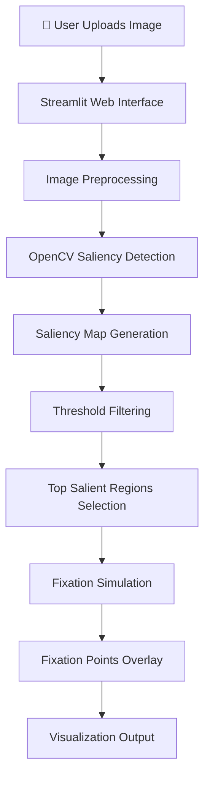

<div align="center">

# 👁️ NeuroVision

### Cognitive Visual Attention Simulation using Saliency and Fixation Modeling

**A cognitive AI simulation that mimics how humans visually explore a scene using saliency maps and fixation-based attention scanning.**
*Upload an image and watch how a cognitive system prioritizes visual information.*

<br>

[](https://www.python.org/)
[](https://streamlit.io/)
[](https://opencv.org/)
[](https://numpy.org/)
[](https://matplotlib.org/)
[]()

</div>

---

# 📖 What is NeuroVision?

NeuroVision is a **Cognitive AI simulation system** that demonstrates how human visual attention works when observing a scene.

Instead of processing images uniformly, humans naturally focus on **regions of interest**. This project simulates that behavior using **saliency maps and fixation-based scanning**, allowing users to observe how an artificial cognitive system prioritizes visual information.

The system works as follows:

1. A user uploads an image representing a **visual scene**.
2. The system generates a **saliency map** highlighting visually prominent regions.
3. The algorithm simulates **fixation points**, mimicking how human eyes move across a scene.
4. The results are visualized interactively through a **Streamlit interface**.

This provides a simple yet powerful demonstration of **attention modeling in cognitive AI systems**.

---

# ✨ Features

| Feature                          | Description                                               |
| -------------------------------- | --------------------------------------------------------- |
| 📸 **Image Upload Interface**    | Upload any PNG or JPG image for simulation                |
| 🎯 **Saliency Map Generation**   | Highlights visually prominent regions                     |
| 👀 **Fixation Simulation**       | Simulates eye movement across salient regions             |
| ⚙️ **Adjustable Parameters**     | Customize blur kernel size, threshold, and fixation count |
| 📊 **Interactive Visualization** | Real-time UI using Streamlit                              |
| 🧠 **Cognitive AI Concepts**     | Demonstrates perception and attention modeling            |
| 🎓 **Educational Tool**          | Ideal for AI and Cognitive Science coursework             |

---

# 🏗️ System Architecture

### Visual Attention Pipeline



---

### Cognitive Processing Workflow

The simulation replicates a simplified version of human visual attention:

1️⃣ **Scene Perception**

* The uploaded image acts as a **visual stimulus**.

2️⃣ **Saliency Computation**

* OpenCV detects regions that visually stand out based on:

  * color contrast
  * edge intensity
  * brightness variations

3️⃣ **Attention Filtering**

* A **threshold filter** removes low-importance regions.

4️⃣ **Fixation Selection**

* The system selects **top N salient points**.
* These points simulate **human eye fixation behavior**.

5️⃣ **Visualization**

* Displays:

  * Original image
  * Saliency heatmap
  * Fixation points overlay

---

# 🛠️ Technology Stack

### Core System

| Component            | Technology    |
| -------------------- | ------------- |
| Programming Language | `Python 3.9+` |
| Web Interface        | `Streamlit`   |
| Computer Vision      | `OpenCV`      |
| Numerical Processing | `NumPy`       |
| Visualization        | `Matplotlib`  |

---

# 📂 Project Structure

```text
visual_attention_streamlit/
│
├── app.py              # Main Streamlit application
├── attention_model.py  # Saliency and fixation logic
├── utils/
│   └── image_utils.py  # Image preprocessing utilities
│
├── requirements.txt    # Project dependencies
└── README.md           # Project documentation
```

---

# 🚀 Installation & Setup

### Prerequisites

* Python 3.9+
* pip

---

## 1️⃣ Clone the Repository

```bash
git clone https://github.com/your-username/visual_attention_streamlit.git
cd visual_attention_streamlit
```

---

## 2️⃣ Create a Virtual Environment (Recommended)

```bash
python -m venv venv
```

### Activate Environment

**Mac/Linux**

```bash
source venv/bin/activate
```

**Windows**

```bash
venv\Scripts\activate
```

---

## 3️⃣ Install Dependencies

```bash
pip install -r requirements.txt
```

---

# 🏃 Running the Application

Launch the Streamlit application:

```bash
streamlit run app.py
```

The application will start locally at:

```
http://localhost:8501
```

---

# 🌐 Application Workflow

### Step 1 — Upload Image

Upload a PNG or JPG image representing the visual scene.

---

### Step 2 — Adjust Simulation Parameters

Using the sidebar controls, configure:

* **Blur kernel size**
* **Saliency threshold**
* **Maximum fixation points**

---

### Step 3 — Generate Attention Simulation

The system processes the image and generates:

* Saliency heatmap
* Fixation simulation

---

### Step 4 — Analyze Output

The UI displays:

| Output          | Description                  |
| --------------- | ---------------------------- |
| Original Image  | Input visual scene           |
| Saliency Map    | Regions attracting attention |
| Fixation Points | Simulated eye movement       |

---

# 🧠 Cognitive AI Concepts Used

| Concept              | Description                                   |
| -------------------- | --------------------------------------------- |
| **Saliency Map**     | Highlights visually important areas           |
| **Fixation**         | A point where the eye briefly focuses         |
| **Visual Attention** | Prioritization of relevant visual stimuli     |
| **Thresholding**     | Filters out less important visual data        |
| **Cognitive AI**     | AI inspired by human perception and cognition |

---

# 🐛 Known Issues & Troubleshooting

### Saliency detection not working properly

Ensure:

* Images are **not extremely low resolution**
* Contrast between objects is sufficient

---

### Streamlit UI not loading

Verify the server started successfully:

```
http://localhost:8501
```

Restart the app if needed.

---

# 🔮 Future Improvements

* 👁️ **Real eye-tracking dataset integration**
* 🎥 **Video attention simulation**
* 📊 **Temporal attention heatmaps**
* 🤖 **Deep learning attention models**
* 🧠 **Object detection + attention fusion**

---

# 🎓 Academic Value

This project demonstrates key concepts from **Cognitive Artificial Intelligence**, including:

* perception modeling
* visual attention mechanisms
* cognitive psychology principles
* computational vision techniques

It serves as a **lightweight educational simulation** for understanding how cognitive systems prioritize information.

---

# 👨‍💻 Author

**Kishore P**
CSE (AI & Robotics) – VIT Chennai

---

# 📜 License

This project is licensed under the **MIT License**.

---

<div align="center">

<br>

<i>Understanding how machines can perceive the world like humans.</i>

<br><br>

<b>NeuroVision</b> — modeling attention in artificial cognitive systems.

</div>
